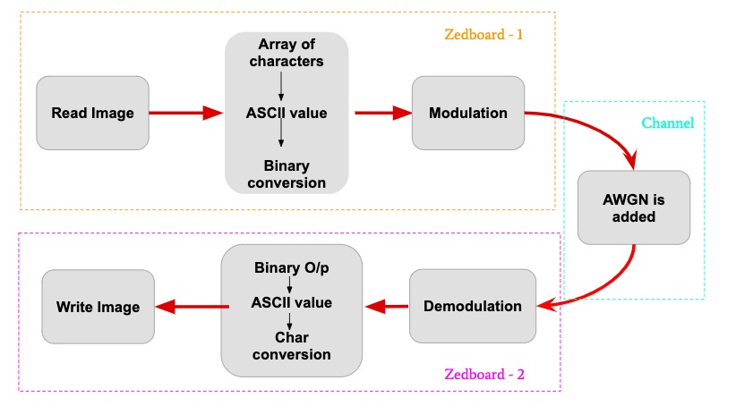

# Fixed Point Image Transmission

Fixed point image transmission using 64 QAM digital modulation technique over wired channel on Zedboard (SoC). 

The concept of Fixed Point Detector is used to use less memory while processing. The floating values occupy more memory compared to integer values. So, this usually converts all the floating point values to integer values.

`pow(2, fixed_pt_bits)` is used to do the work. `fixed_pt_bits` can be upto 4 bits, 8 bits or 16 bits in C++.

This was course project in 6th Semester of B.Tech during Design Lab II course.

# Procedure

- Took an image from Google of 60 x 60 bmp format.

- Using MATLAB, I've generated greyscale image of 26 x 26 with size of 1024 bytes.

- Added noise to image during modulation over 64 QAM channel in MATLAB.

- Demodulated and reconstructed the image successfully.

- However, in C++ code procedure was different. MATLAB reads image in binary form.

- So, in C++ first I converted the image to ASCII followed by integer conversion and then followed by decimal to binary conversion.

- Modulated and Demodulated over 64 QAM wired channel.

- `QAMDATA.txt` is 64 QAM symbols with zero noise.

- `QAMDATA_WITH_NOISE.txt` is 64 QAM symbols with Gaussian noise.

- Reconstructed the image by converting back the received bits to integer values followed by ASCII.

- The `QAMDATA.txt` was tested on Zedboard. Noise was from wired channel already. Image reconstruction on Zedboard was successful.

# System Design

# Project Video

The project video link shows the project simulation in MATLAB.

Video link: https://www.youtube.com/watch?v=xtboY8SEiPY

# Status - Completed

Both C++ code and MATLAB code are available and working.
